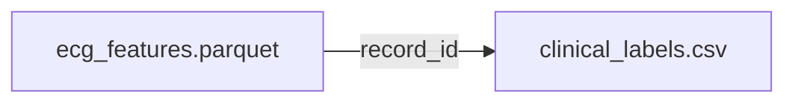

# Data Dictionary -- AFib Classification

## Data Sources

| Source | Format | Description |
|--------|--------|-------------|
| ECG Features | Parquet | ECG-derived feature matrix (RR, P-wave, QRS, HRV) |
| Clinical Labels | CSV | AF diagnosis labels and clinical metadata |

## Data Join Pattern

- **ecg_features <-> clinical_labels**: Join on `record_id`

## Variable Catalog -- ECG Features (Model Input)

| Category | Example Features | Description |
|----------|-----------------|-------------|
| RR Intervals | rr_mean, rr_std, rr_rmssd, rr_pnn50 | RR interval statistics |
| P-wave | p_wave_amplitude, p_wave_duration, p_wave_area | P-wave morphology |
| QRS Complex | qrs_duration, qrs_amplitude, qrs_axis | QRS complex features |
| HRV | hrv_sdnn, hrv_lf_power, hrv_hf_power, hrv_lf_hf_ratio | Heart rate variability |

## Variable Catalog -- Target

| Variable | Type | Values | Description |
|----------|------|--------|-------------|
| af_label | int | 0, 1 | AF diagnosis (0=no AF, 1=AF) |

## Variable Catalog -- Excluded Features (inference_unavailable)

| Variable | Exclusion Reason |
|----------|-----------------|
| record_id | Subject identifier -- causes group leakage |
| diagnosis_date | Temporal information -- causes leakage |
| af_label | Target variable |
| cardiologist_notes | Text label data -- direct leakage |

## Missing Data Strategy

| Variable Type | Strategy | Rationale |
|---------------|----------|-----------|
| ECG features | Median imputation (within CV fold) | Preserve distribution |
| Target (af_label) | Row exclusion | Cannot impute target |
| record_id | Row exclusion | Cannot group without ID |

## Encoding Rules

- af_label: integer 0/1 (already binary)
- All ECG features: continuous float values
- No categorical encoding required for ECG features
