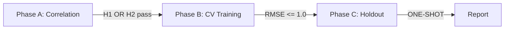

# Pre-Registered Hypotheses -- Knee OA Progression

**Experiment**: knee-oa-progression
**Date registered**: 2026-03-03
**Status**: Pre-registered (not yet tested)

## Primary Hypotheses

### H1: Knee Angle Feature Correlation
- **Statement**: At least one knee angle feature extracted from 100 Hz joint angle time-series has Spearman |rho| >= 0.4 with KL grade (0-4).
- **Rationale**: OA progression restricts knee ROM and alters peak flexion angles during gait. Prior literature reports ROM reduction of ~10-15 degrees per KL grade increase.
- **Primary metric**: Maximum |Spearman rho| across knee angle features vs KL grade.
- **Gate**: |rho| >= 0.4 (moderate correlation).

### H2: Gait Cycle Feature Correlation
- **Statement**: At least one gait cycle feature (cadence, gait speed, stride length, etc.) has Spearman |rho| >= 0.4 with KL grade.
- **Rationale**: OA progression reduces gait speed, shortens stride length, and increases gait variability as compensatory mechanisms.
- **Primary metric**: Maximum |Spearman rho| across gait cycle features vs KL grade.
- **Gate**: |rho| >= 0.4 (moderate correlation).

### H3: Ordinal Regression Predictive Performance
- **Statement**: An ordinal regression model (LightGBM or XGBoost) achieves pooled RMSE <= 1.0 for KL grade prediction using GroupKFold 5-fold CV.
- **Rationale**: RMSE <= 1.0 means predictions are, on average, within 1 KL grade of truth -- clinically meaningful precision.
- **Primary metric**: Pooled RMSE across 5 folds.
- **Gate**: RMSE <= 1.0.

### H4: Temporal Generalization
- **Statement**: The best CV model maintains RMSE <= 1.0 AND Spearman rho >= 0.5 on the temporal holdout set (train < 2024, test >= 2024).
- **Rationale**: Medical prediction models must generalize across time to be clinically useful.
- **Primary metrics**: RMSE and Spearman rho on holdout.
- **Gate**: RMSE <= 1.0 AND rho >= 0.5.

## Phase Progression Rules

- Phase A -> Phase B: At least one of H1 or H2 must pass.
- Phase B -> Phase C: At least one model must achieve RMSE <= 1.0.
- Phase C: ONE-SHOT evaluation. No iteration permitted.

## Multiple Comparison Correction
- Phase A: Bonferroni correction (alpha = 0.05 / 2 = 0.025) for H1 and H2.
- Phase B: Two models tested (LightGBM, XGBoost). Gate applies to each independently.
- Phase C: Single evaluation, no correction needed.

## Supplementary Analyses (Non-gating)
- Known-group validity: KL 3-4 vs KL 0-1 effect sizes
- KL grade distribution analysis
- Feature importance ranking
- Per-grade sensitivity analysis
- Calibration analysis (medical compliance)

## Post-hoc Analyses
Any findings discovered during analysis that were not pre-registered above
MUST be clearly labeled as "exploratory" in all reports.
