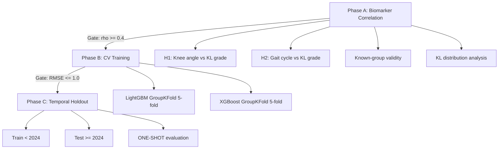

# Experiment Design -- Knee OA Progression (knee-oa-progression)

## Objective

Predict Kellgren-Lawrence (KL) grade (0-4, ordinal) from knee joint angle time-series data, enabling non-radiographic screening for osteoarthritis progression.

## Data Sources

| Source | Format | Description |
|--------|--------|-------------|
| Joint angle time-series | HDF5 | 100 Hz knee flexion/extension recordings |
| Clinical metadata | CSV | Patient demographics, visit dates, KL grades |

## Feature Groups

| Group | Type | Examples |
|-------|------|----------|
| knee_angle_features | Extracted from HDF5 | ROM, peak angles, angular velocity |
| gait_cycle_features | Derived from time-series | Cadence, stride length, gait speed |
| demographic | Clinical metadata | Age, sex |

## Forbidden Features (Leakage Prevention)

| Feature | Reason |
|---------|--------|
| patient_id | Identity leak |
| visit_date | Temporal information |
| kl_grade | Target variable |
| radiograph_score | Derived from target |
| side | Grouping variable (not a feature) |

## 3-Phase Experimental Pipeline

## Models

| Model | Library | Task |
|-------|---------|------|
| LightGBM | lightgbm | Ordinal regression (via regression) |
| XGBoost | xgboost | Ordinal regression (via regression) |

## Cross-Validation

- Method: GroupKFold (5-fold)
- Group key: patient_id
- Side co-location: L/R grouped by patient_id
- Preprocessing: Fit inside fold (medical compliance)

## Holdout

- Method: Temporal split
- Train: visit_date < 2024
- Test: visit_date >= 2024
- Constraint: ONE-SHOT (no iteration on holdout results)

## Compliance Level: Medical

- Bootstrap 95% CIs for all primary endpoints
- Calibration analysis
- Per-grade sensitivity reporting
- Feature interpretability (SHAP)
- Baseline comparison (mean predictor)
- Confusion matrix for ordinal classification
